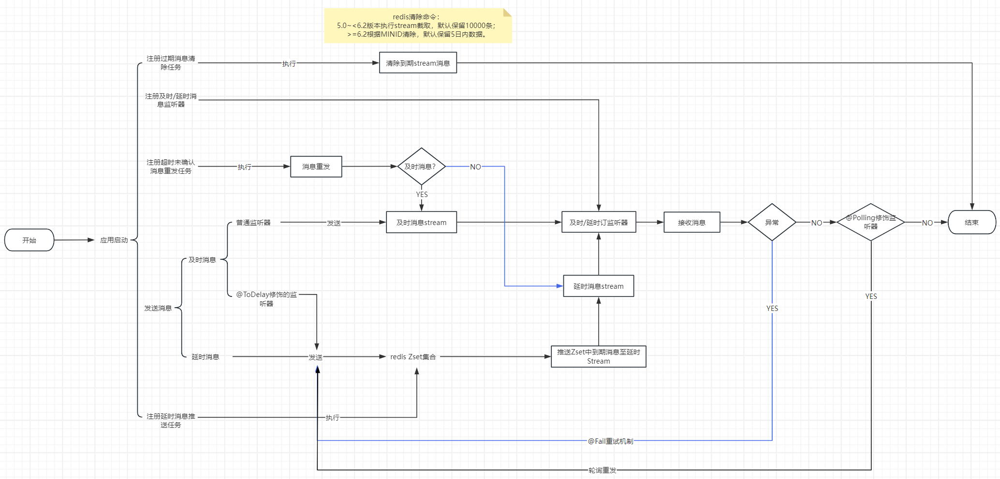

# eventbus架构知之

## RabbitMQ

### 及时消息

#### 正常消息

交换机key: `eventbus.timely.exchange.服务ID` 
路由key:   `eventbus.timely.routingKey.服务ID|消息编码` 
队列key:   `eventbus.timely.queue.服务ID|消息编码|监听器全类名` 

#### 异常重试

交换机key: `eventbus.delay.exchange.服务ID` 
路由key:   `eventbus.timely.retry.routingKey.服务ID|消息编码|监听器全类名` 
队列key:   `eventbus.timely.retry.queue.服务ID|消息编码|监听器全类名` 

### 延时消息

#### 正常消息

交换机key: `eventbus.delay.exchange.服务ID` 
路由key:   `eventbus.delay.routingKey.服务ID|消息编码` 
队列key:   `eventbus.delay.queue.服务ID|消息编码|监听器全类名` 

#### 异常重试

交换机key: `eventbus.delay.exchange.服务ID` 
路由key:   `eventbus.delay.retry.routingKey.服务ID|消息编码|监听器全类名` 
队列key:   `eventbus.delay.retry.queue.服务ID|消息编码|监听器全类名`

## Redis

### 架构图
如下图：

### 及时消息：

#### 正常队列

stream队列key：`eventbus:timely:queue:服务ID|消息编码`
stream消费者组key:`com.github.likavn.eventbus.demo.listener.DemoMsgListener`

#### 失败重试

zset key:          `eventbus:timely:retry:zset:服务ID|消息编码|监听器类全类名`
lock key:          `eventbus:timely:retry:lock:服务ID|消息编码|监听器类全类名`
stream queue key:  `eventbus:timely:retry:queue:服务ID|消息编码|监听器类全类名`
stream消费者组key:  `com.github.likavn.eventbus.demo.listener.DemoMsgListener`

### 延时消息

#### 正常消息

zset key:       `eventbus:delay:zset:服务ID|消息编码` 
lock key:       `eventbus:delay:lock:服务ID|消息编码` 
stream队列key:   `eventbus:delay:queue:服务ID|消息编码` 
stream消费者组key:`com.github.likavn.eventbus.demo.listener.DemoMsgListener`

#### 失败重试

zset key:         `eventbus:delay:retry:zset:服务ID|消息编码|监听器类全类名` 
lock key:         `eventbus:delay:retry:lock:服务ID|消息编码|监听器类全类名` 
stream队列key:     `eventbus:delay:retry:queue:服务ID|消息编码|监听器类全类名` 
stream消费者组key:  `com.github.likavn.eventbus.demo.listener.DemoMsgListener`

## RocketMQ

### 及时消息

#### 正常消息

队列key: `eventbus_timely_queue_服务ID|消息编码` 
消费者组名称：`eventbus_timely_queue_服务ID|消息编码|消息监听器全类名` 

#### 异常重试

队列key: `eventbus_timely_retry_queue_服务ID|消息编码|消息监听器全类名` 
消费者组名称: `eventbus_timely_retry_queue_服务ID|消息编码|消息监听器全类名` 

### 延时消息

#### 正常消息

队列key: `eventbus_delay_queue_服务ID|消息编码` 
消费者组名称：`eventbus_delay_queue_服务ID|消息编码|消息监听器全类名` 

#### 异常重试

队列key: `eventbus_delay_retry_queue_服务ID|消息编码|消息监听器全类名` 
消费者组名称: `eventbus_delay_retry_queue_服务ID|消息编码|消息监听器全类名` 
