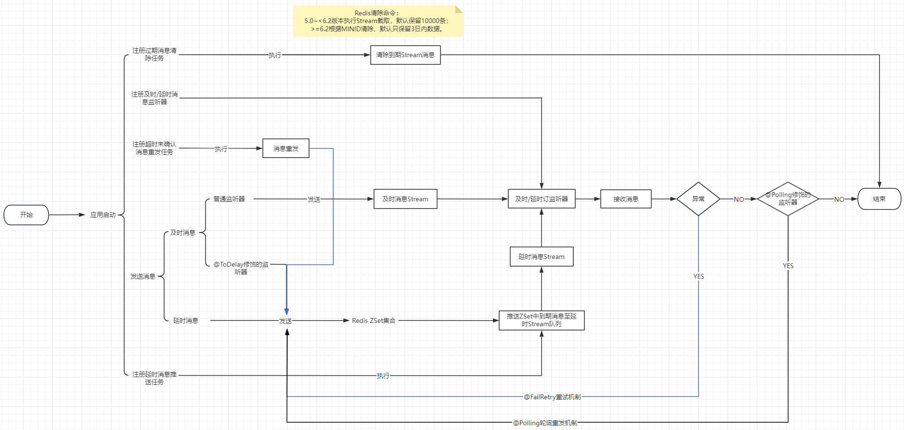

# eventbus架构知之

## RabbitMQ

### 及时消息

#### 正常消息

交换机key: `ebus.t.exchange.服务ID` 
路由key:   `ebus.t.routingKey.服务ID|消息编码` 
队列key:   `ebus.t.queue.服务ID|消息编码|监听器全类名` 

#### 异常重试

交换机key: `ebus.d.exchange.服务ID` 
路由key:   `ebus.t.retry.routingKey.服务ID|消息编码|监听器全类名` 
队列key:   `ebus.t.retry.queue.服务ID|消息编码|监听器全类名` 

### 延时消息

#### 正常消息

交换机key: `ebus.d.exchange.服务ID` 
路由key:   `ebus.d.routingKey.服务ID|消息编码` 
队列key:   `ebus.d.queue.服务ID|消息编码|监听器全类名` 

#### 异常重试

交换机key: `ebus.d.exchange.服务ID` 
路由key:   `ebus.d.retry.routingKey.服务ID|消息编码|监听器全类名` 
队列key:   `ebus.d.retry.queue.服务ID|消息编码|监听器全类名`

## Redis

### 架构图
如下图：

### 及时消息：

#### 正常队列

stream队列key：`ebus:t:queue:{服务ID|消息编码}` 
stream消费者组key:`监听器类全类名`

#### 失败重试

zset key:          `ebus:t:retry:zset:{服务ID|消息编码|监听器类全类名}` 
lock key:          `ebus:t:retry:lock:{服务ID|消息编码|监听器类全类名}` 
stream queue key:  `ebus:t:retry:queue:{服务ID|消息编码|监听器类全类名}` 
stream消费者组key:  `监听器类全类名`

### 延时消息

#### 正常消息

zset key:       `ebus:d:zset:{服务ID|消息编码}` 
lock key:       `ebus:d:lock:{服务ID|消息编码}` 
stream队列key:   `ebus:d:queue:{服务ID|消息编码}` 
stream消费者组key:`监听器类全类名`

#### 失败重试

zset key:         `ebus:d:retry:zset:{服务ID|消息编码|监听器类全类名}` 
lock key:         `ebus:d:retry:lock:{服务ID|消息编码|监听器类全类名}` 
stream队列key:     `ebus:d:retry:queue:{服务ID|消息编码|监听器类全类名}` 
stream消费者组key:  `监听器类全类名`

## RocketMQ

### 及时消息

#### 正常消息

队列key: `ebus_t_服务ID|消息编码` 
消费者组名称：`ebus_t_服务ID|消息编码|消息监听器全类名` 

#### 异常重试

队列key: `ebus_t_retry_服务ID|消息编码|消息监听器全类名` 
消费者组名称: `ebus_t_retry_服务ID|消息编码|消息监听器全类名` 

### 延时消息

#### 正常消息

队列key: `ebus_d_服务ID|消息编码` 
消费者组名称：`ebus_d_服务ID|消息编码|消息监听器全类名` 

#### 异常重试

队列key: `ebus_d_retry_服务ID|消息编码|消息监听器全类名` 
消费者组名称: `ebus_d_retry_服务ID|消息编码|消息监听器全类名` 
